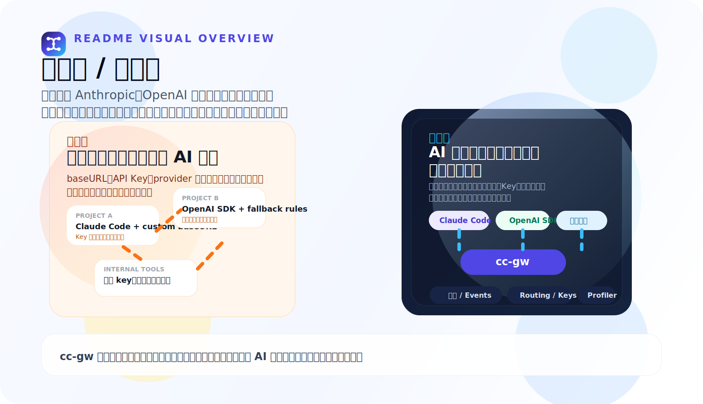
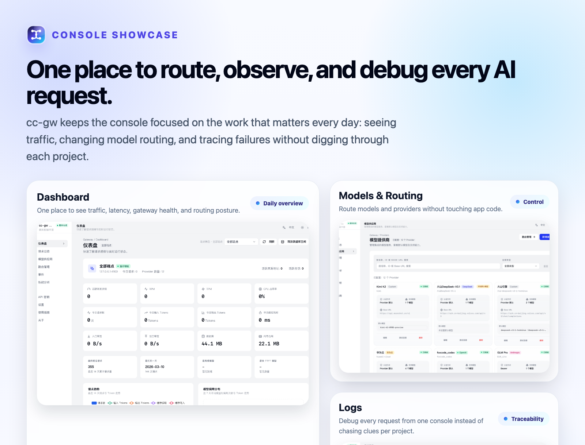

# cc-gw

GitHub 仓库：[chenpu17/cc-gw2](https://github.com/chenpu17/cc-gw2)

别再让 AI 配置散落在每个项目里。

`cc-gw` 帮你把 Claude Code、OpenAI SDK、Anthropic SDK 和内部工具统一到一个本地优先入口，把 Key、路由、日志和排查收回到控制台里。

`cc-gw` gives personal developers and small software teams one local-first entry for Claude Code, OpenAI SDK, Anthropic SDK, and internal tools, so keys, routing, logs, and debugging stop living in every project.



- 接入前：`baseURL`、API Key、provider 切换和排查线索散落在每个项目里
- 接入后：客户端继续走熟悉协议，路由、日志、事件、Profiler 和 API Key 回到一个控制台
- 迁移方式：先在本地跑起来，再逐步共享给团队，不用一开始就上重平台

```bash
npm install -g @chenpu17/cc-gw
cc-gw start --foreground --port 4100
```

```text
Product site: http://127.0.0.1:4100/
Web console:  http://127.0.0.1:4100/ui
```

## 快速入口 / Quick Links

- 产品官网 / Product site: `GET /`
- 控制台 / Web console: `GET /ui/`
- npm: [`@chenpu17/cc-gw`](https://www.npmjs.com/package/@chenpu17/cc-gw)
- 文档索引 / Docs: [`docs/README.md`](./docs/README.md)
- 产品定位 / Positioning: [`docs/product-positioning.md`](./docs/product-positioning.md)
- 官网发布 / Landing publishing: [`docs/landing-publishing.md`](./docs/landing-publishing.md)

## 你会少掉哪些麻烦

- 不用在每个项目里重复配置 `baseURL`、API Key 和 provider 差异
- 出问题先看 Logs、Events、Profiler 和链路，而不是在业务代码里盲猜
- 换模型、换 provider、调路由时，尽量不打扰现有客户端和业务逻辑
- 可以先自己本地跑起来，再逐步给团队共享，而不是一开始就上重平台

## 定位

- 适合个人开发者、AI 产品小队和 `1-100` 人软件研发团队先把 AI 调用入口收口
- 更像研发团队自己的日常工作台，而不是给超大组织准备的企业 AI 平台
- 最适合开发机、本地常驻、共享团队实例和轻量自托管服务

如果你的目标是跨 BU 的复杂审批、企业 SSO、集团级策略中台和重治理平台，`cc-gw` 不是那类产品。

当前主线已收敛到正式版，当前 npm 包版本以仓库根目录 `package.json` 与 release 为准。对用户最直接的变化是：你可以继续用熟悉的 CLI、Web UI、配置目录和 SQLite 数据，同时获得更低的常驻资源占用；后端 Rust 化后，在相同场景下内存占用实测可降至旧 Node.js 实现的约 `1/20`。

## 项目说明

- 当前 GitHub 仓库名是 `cc-gw2`
- 对外 npm 包名仍然是 `@chenpu17/cc-gw`
- 命令行入口仍然是 `cc-gw`

## 项目目标

- Web 前端保持不改，继续复用现有管理台
- 后端接口尽量对齐旧 Node.js 版本的外部行为
- SQLite 数据、配置目录、密钥格式继续兼容旧版本
- CLI 保持 `start`、`stop`、`restart`、`status`、`version` 等命令习惯
- npm 安装默认使用预编译原生二进制，不要求用户本机安装 Rust
- 发布目标尽量提供自包含二进制，减少宿主机运行时依赖

## 正式版亮点

- Rust 后端已替代旧 Node.js 服务端，兼容原有使用方式
- 常驻内存占用实测下降到旧实现的约 `1/20`
- npm 安装默认分发预编译原生二进制，普通用户不需要本机 Rust 环境
- Web 控制台、CLI 命令习惯、配置文件路径与 SQLite 数据格式继续兼容

## 控制台预览

下面这张展示图基于最新控制台截图拼接，聚焦最常用的三个工作面：总览、模型路由和日志排查。



- `Dashboard`：看流量、延迟、健康状态和今天的整体走势
- `Models & Routing`：切模型、调 provider、维护路由，不用翻业务工程
- `Logs`：请求进来之后，直接在一个地方追踪链路和异常

## 快速开始

全局安装：

```bash
npm install -g @chenpu17/cc-gw
```

以前台模式启动：

```bash
cc-gw start --foreground --port 4100
```

或以守护进程模式启动：

```bash
cc-gw start --daemon --port 4100
```

启动后访问：

```text
http://127.0.0.1:4100/
```

根路径默认挂产品官网和定位说明，管理控制台继续使用：

```text
http://127.0.0.1:4100/ui
```

默认本地数据目录：

- 配置：`~/.cc-gw/config.json`
- 数据库：`~/.cc-gw/data/gateway.db`
- 日志：`~/.cc-gw/logs`
- PID：`~/.cc-gw/cc-gw.pid`

## 当前实现

- Rust workspace：`crates/cc-gw-core`、`crates/cc-gw-server`
- 兼容型 CLI：`src/cli`
- 原 Web 前端：`src/web`
- 兼容配置路径：`~/.cc-gw/config.json`
- 兼容数据库路径：`~/.cc-gw/data/gateway.db`
- 兼容旧 `encryption.key`、旧 `api_keys.key_ciphertext`、旧 Web Auth `scrypt` 密码格式
- 已覆盖 Web 管理台和客户端依赖的核心接口，包括 `/ui`、`/assets/*`、`/favicon.ico`、`/api/*`、`/v1/*`、`/openai/v1/*`
- 已实现 Anthropic / OpenAI Chat / OpenAI Responses 的代理与流式转换
- 已实现 API Key、日志、事件、统计、路由预设、自定义端点和 SQLite 兼容迁移

## 本地开发

```bash
pnpm install
pnpm build
pnpm dev
```

直接通过 CLI 前台启动：

```bash
pnpm --filter @cc-gw/cli exec tsx index.ts start --foreground
```

`pnpm build` 会执行：

1. 构建 Rust 服务端
2. 构建 `src/cli/dist`
3. 构建 `src/web/dist`
4. 为当前平台生成 `bin/<platform>-<arch>/cc-gw-server`
5. 同步当前平台 native npm 子包中的原生二进制

CLI 启动时的后端解析顺序：

1. 平台专用 native npm 子包
2. `CC_GW_SERVER_BIN`
3. 工作区 `bin/<platform>-<arch>/cc-gw-server`
4. 工作区 `target/release` 或 `target/debug`
5. `cargo run -p cc-gw-server --`

## 安装与发布

对外发布模型：

- 根包：`@chenpu17/cc-gw`
- 平台包：`@chenpu17/cc-gw-darwin-arm64`
- 平台包：`@chenpu17/cc-gw-linux-x64`
- 平台包：`@chenpu17/cc-gw-linux-arm64`
- 平台包：`@chenpu17/cc-gw-win32-x64`

用户安装：

```bash
npm install -g @chenpu17/cc-gw
```

安装时会通过 `optionalDependencies` 自动拉取当前平台的预编译二进制，无需本地编译 Rust。
Linux 版本使用 `musl`，Windows 版本使用静态 CRT，目标是让用户只需 `npm install` 即可直接运行。

本地在仓库中直接验证未发布包时，需要额外安装当前平台 native 包；否则 CLI 会回退到 `cargo run`：

```bash
pnpm pack:dry-run
pnpm --dir packages/native/darwin-arm64 pack --pack-destination ../../../.pack/native
npm install -g ./.pack/native/chenpu17-cc-gw-darwin-arm64-<version>.tgz
npm install -g ./.pack/chenpu17-cc-gw-<version>.tgz
```

当前发布目标：

- macOS arm64
- Linux x64
- Linux arm64
- Windows x64（npm 包名为 `win32-x64`）

## 验证

建议在上传或发版前执行：

```bash
cargo test
pnpm build
pnpm smoke:cli
pnpm pack:dry-run
```

首次运行 Web E2E 前，先安装 Playwright Chromium：

```bash
pnpm exec playwright install --with-deps chromium
pnpm test:e2e:web
```

如需刷新 `README` 中使用的英文亮色截图：

```bash
pnpm docs:readme-screenshots
```

如果只想跑分层回归，可直接用：

```bash
pnpm test:e2e:web:core
pnpm test:e2e:web:hardening
pnpm test:e2e:web:visual
```

如需刷新页面级截图基线：

```bash
pnpm test:e2e:web:update-snapshots
```

当前仓库已具备：

- Web UI 构建通过
- Web Playwright E2E 通过
- 页面级视觉截图基线回归
- 低频危险路径 E2E
- CLI smoke 流程可单独执行
- GitHub Actions CI 与 release workflow 已落地

## CI 与文档

- 文档索引：[`docs/README.md`](docs/README.md)
- 系统设计：[`docs/system-design.md`](docs/system-design.md)
- 存储设计：[`docs/database-schema.md`](docs/database-schema.md)
- API 兼容矩阵：[`docs/api-compatibility.md`](docs/api-compatibility.md)
- 日常校验：[`ci.yml`](.github/workflows/ci.yml)
- 发布流水线：[`release.yml`](.github/workflows/release.yml)
- npm 打包说明：[`docs/npm-packaging.md`](docs/npm-packaging.md)
- GitHub 上传和发版清单：[`docs/github-release-checklist.md`](docs/github-release-checklist.md)
